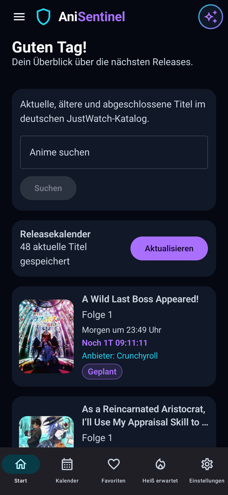
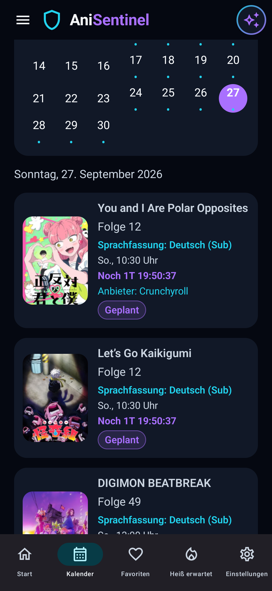
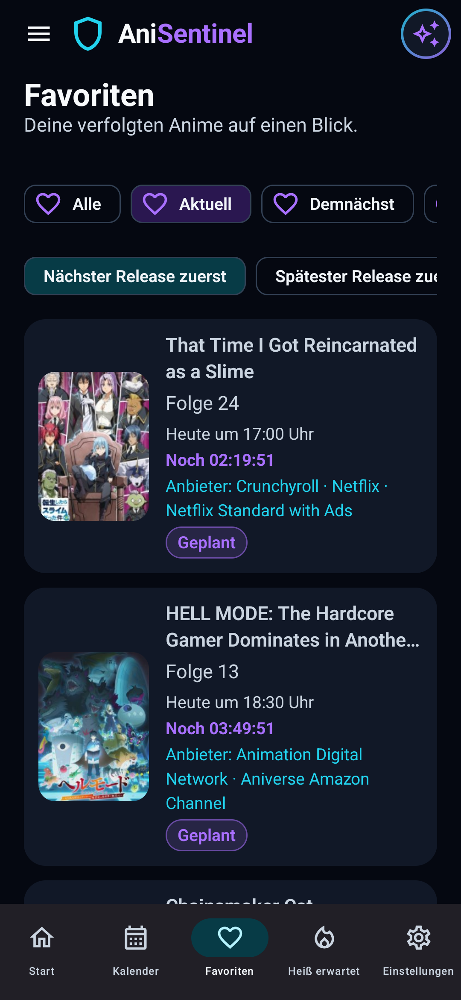
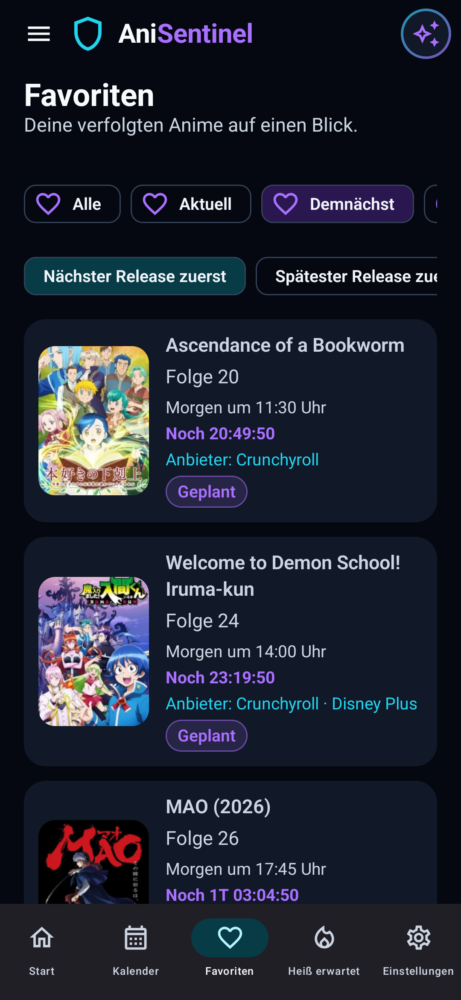
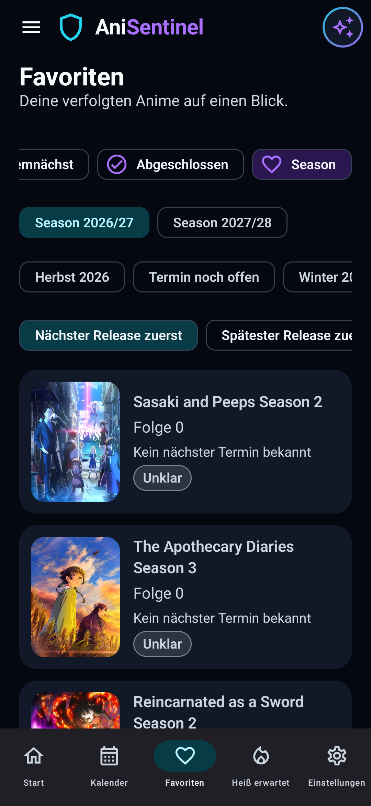
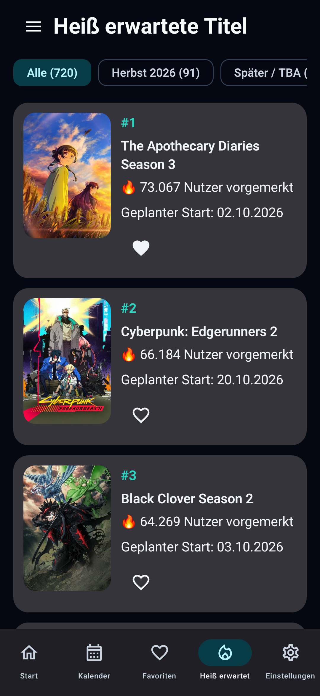
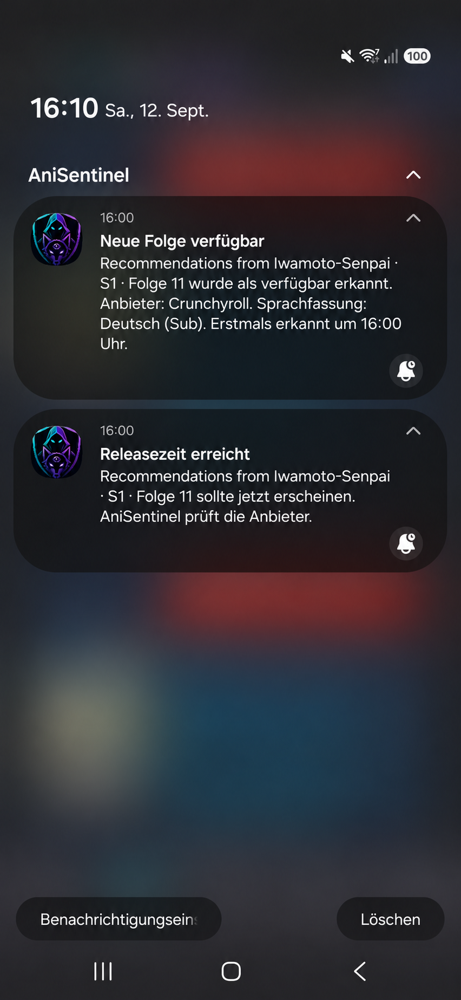
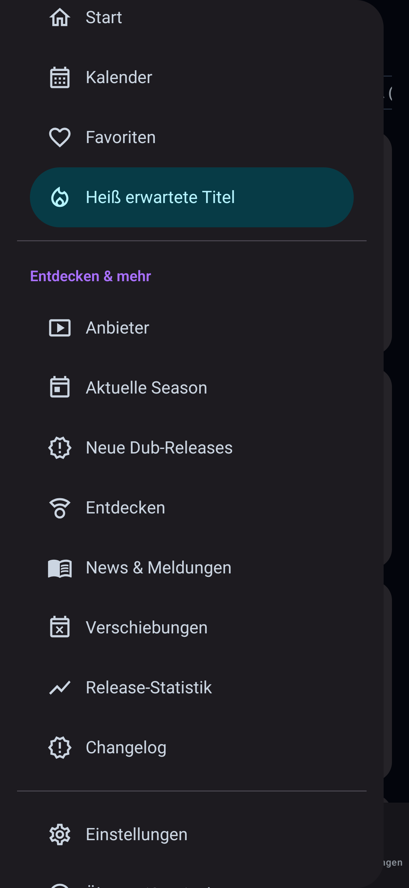

# AniSentinel

Aktueller Diagnose-/Teststand: **v0.25.16 (Build 21, versionCode 67)**. ?Hei? erwartete Titel? zeigt reale, noch nicht gestartete Anime nach AniList-Popularity, bietet dynamische Saisonfilter und f?hrt zu einer eigenen Future-Detailseite. Titelbezogene Anime2You-Meldungen werden automatisch aktualisiert und auf Trailer/Teaser, Starttermine, Verschiebungen, Disc-Releases sowie Anbieter-/Lizenzmeldungen derselben Staffel begrenzt. Die vier Einstellungsbereiche Kalender, Sync & Backup, Datenschutz und Anbieter bleiben funktionsf?hig.

AKIBA PASS wird f?r von JustWatch zugeordnete Titel ?ber ?ffentliche Produktseiten gepr?ft; best?tigte kaufbare Staffeln und Episoden erhalten Anbieterlinks. Apple TV wird allgemein ?ber eine eindeutige JustWatch-DE-Anbieterreferenz und ?ffentlich gerenderte Apple-TV-Folgenkarten eingelesen. Diese Eintr?ge sind **Teil-Katalogdaten, keine best?tigte Abspiel- oder Apple-TV+-Abo-Verf?gbarkeit**. Nicht ?ffentlich sichtbare Staffeln/Folgen werden weder aus AniWorld noch aus JustWatch erg?nzt. Bei Conan liefert die ?ffentliche Apple-Seite nur einen Ausschnitt; die App behauptet daher keinen vollst?ndigen Apple-TV-Episodenkatalog. Der Debug-Signaturschl?ssel bleibt ausschlie?lich lokal au?erhalb des Repositories.

Der Bereich **Entdecken** zeigt aus dem deutschen JustWatch-Datenbestand nur sicher als Anime erkannte Serien und Filme sowie ausdr?cklich belegte Live-Action-Adaptionen. Der allgemeine JustWatch-Film- und Serienkatalog wird dort nicht angeboten.

> ?? **Entwicklungs- und Testversion:** AniSentinel befindet sich in aktiver Entwicklung. Externe Webseiten und inoffizielle Schnittstellen k?nnen sich ?ndern; Provideradapter und historische Importe werden weiterhin mit realen Releases validiert.

## Was ist AniSentinel?

AniSentinel ist eine native Android-App f?r deutsche Anime-Releasetermine. Sie b?ndelt aktuelle und historische Termine, Favoriten, Countdown-Anzeigen, Providerzuordnungen und Benachrichtigungen in einer responsiven Jetpack-Compose-Oberfl?che.

Releaseinformationen verschiedener Quellen werden ?ber eine kanonische Identit?t aus Titel-ID, realer Staffel, Folge und Sprachfassung verbunden. AniWorld-, JustWatch- und Provider-IDs bleiben Herkunftsnachweise und d?rfen weder Verschiebungen noch Verf?gbarkeit auf eine andere Episode ?bertragen.

## Screenshots

| Startseite | Kalender |
|---|---|
|  |  |

| Favoriten ? Aktuell | Favoriten ? Demn?chst |
|---|---|
|  |  |

| Favoriten ? Season | Hei? erwartet |
|---|---|
|  |  |

| Benachrichtigungen | Seitenmen? |
|---|---|
|  |  |

## Hauptfunktionen

- deutscher Anime-Releasekalender mit getrennten `GER_SUB`- und `GER_DUB`-Eintr?gen
- Startseite, Kalender, Favoriten, Entdecken, Einstellungen und Detailansicht
- sekundengenaue Countdowns aus fester Zielzeit ohne Drift
- stille Release-Pr?fstarts sowie deduplizierte Availability- und technische Fehlermeldungen
- provider-first Verf?gbarkeitspr?fung ?ber ?ffentliche Crunchyroll-, Netflix-, Disney+-, ADN- und ANIVERSE-Metadaten
- AniWorld als Quelle aktueller deutscher Termine und als letzter technischer Fallback
- historische Crunchyroll-Termine f?r gezielt synchronisierte Monate
- News- und Verschiebungssignale ?ber Anime2You
- sichere HTTPS-Deep-Links zu real ermittelten Providerseiten
- Room als alleinige lokale UI-Datenbasis; DataStore f?r Einstellungen
- reale JustWatch-DE-Titelmetadaten f?r Handlung und Genres sowie Studioangaben, sofern die ?ffentliche Quelle sie eindeutig liefert
- Pull-to-Refresh in den datenabh?ngigen Hauptansichten; bestehende Room-Daten bleiben bei Netzwerkfehlern sichtbar
- kanonische Anime-Staffeln getrennt von providerabh?ngigen Staffelnummern
- persistente Providerwahl pro Anime und Staffel; die Episodenansicht ?bernimmt die reale Staffel-/Saga-Struktur des gew?hlten Direktanbieters
- globale, r?ckw?rtskompatible Sichtbarkeitsfilter f?r Crunchyroll, ADN, Netflix, Disney+ und aniverse
- Kalenderfilter f?r Sprachfassung, vergangene Termine und Favoriten
- versionierter lokaler JSON-Export/-Import ?ber Androids System-Dateiauswahl, einschlie?lich eines ausw?hlbaren AniList-Bestands f?r ?Hei? erwartete Titel?
- lokale Datenschutz?bersicht mit Berechtigungsstatus und best?tigungspflichtiger L?schung von Nutzerdaten
- ?Hei? erwartete Titel? aus AniLists dokumentierter GraphQL-API: ausschlie?lich `NOT_YET_RELEASED`, Popularity-Ranking, 24-Stunden-Cache und ehrlicher DACH-Lizenzstatus

### Hei? erwartete Titel

AniList liefert f?r diesen getrennten Future-Bereich Nutzerinteresse, Status, geplanten Start, Cover, Format, Studio und Fortsetzungsbeziehungen. Die Sortierung entspricht absteigend der echten AniList-Popularity; die UI bezeichnet diese Zahl deshalb als vorgemerkte Nutzer und nicht als Stimmen. Laufende Titel werden nicht in dieser Liste gef?hrt.

Der Liveabruf erfolgt ?ber AniLists offiziellen GraphQL-Endpunkt. Da AniList die ?ffentliche API zeitweise mit HTTP 403 und dem Hinweis auf schwere Stabilit?tsprobleme deaktiviert, enth?lt die APK zus?tzlich den letzten erfolgreich gepr?ften AniList-Grundbestand. Eine frische Installation zeigt dadurch auch w?hrend eines API-Ausfalls Titel statt `Alle (0)`. Ein sp?terer erfolgreicher Liveabruf ersetzt diesen Bestand automatisch; Pull-to-Refresh bleibt ein echter Aktualisierungsversuch. Der aktuelle Bestand kann au?erdem im lokalen Backup mitgesichert und nach einer Neuinstallation wiederhergestellt werden.

Die automatische AniSearch-Anreicherung ist derzeit aus dem regul?ren Produktivabruf genommen. Reale Ger?tetests erhielten bereits beim ersten normalen Inhaltsrequest HTTP 429, ohne `Retry-After`; weitere Requests wurden von AniSentinel korrekt durch einen globalen Cooldown verhindert. F?r Anime-Metadaten steht zudem keine allgemein freigegebene offizielle API bereit. AniSentinel versucht deshalb weder, das Limit zu umgehen, noch AniSearch durch Browser-Imitation, Proxys oder wiederholte Requests zu belasten. Der vorbereitete konservative Titel-, Staffel- und Cour-Abgleich bleibt gekapselt im Quellcode und wird wieder produktiv eingebunden, sobald f?r das Projekt ein zul?ssiger AniSearch-API-Zugang bereitsteht.

Eine DACH-Best?tigung entsteht ausschlie?lich durch den deutschen Eintrag innerhalb dieses regionalen Blocks. Publisher und `Ver?ffentlicht` werden aus demselben L?ndereintrag gelesen. `dachAvailableFrom`, `sourceObservedAt` und `firstDetectedAt` bleiben getrennt, damit ein Erkennungsdatum niemals als Verf?gbarkeitsbeginn erscheint. Suchtreffer, Detail-HTML sowie positive und negative Nachweise werden begrenzt gecacht; HTTP 429 oder Zugriffssperren stoppen die Anreicherung, ohne g?ltige Cachewerte zu l?schen.

### Release-Lifecycle und Providerwahl

Ein ?berf?lliger Release bleibt nur w?hrend seines fachlich relevanten Beobachtungsfensters im engen AUTO-Watcher. Ein bekannter Episodennachfolger beendet den alten Watcher nach einer kurzen Karenz; sp?testens nach 24 Stunden wird ein weiterhin unbest?tigter Eintrag als `STALE_UNCONFIRMED` gef?hrt. Dabei wird weder Verf?gbarkeit erfunden noch eine technische Push-Meldung erzeugt. Historien- und Providerbackfills d?rfen den Status sp?ter weiterhin korrigieren.

Technische Providerfehler werden pro Provider persistent gez?hlt. Eine sichtbare Systemmeldung ist fr?hestens nach drei aufeinanderfolgenden Fehlern ?ber mindestens zehn Minuten m?glich. Ein sechs Stunden langer providerweiter Cooldown verhindert, dass ein einzelner Crunchyroll-Ausfall f?r jeden Favoriten eine eigene Meldung erzeugt. `AVAILABLE` oder `NOT_AVAILABLE_YET` setzt den Fehlerzustand zur?ck.

Room trennt `AnimeSeason`, `ProviderSeasonMapping` und `ProviderPreference`. Eine manuelle Staffelwahl hat Vorrang, danach folgt eine Anime-Vorgabe, anschlie?end ein f?r die konkrete deutsche Staffel best?tigtes Crunchyroll-Angebot und erst danach ein anderer best?tigter DACH-Anbieter. Fehlt ein belegtes Angebot, zeigt die App dies ehrlich an.

### JustWatch-Metadaten

Bei einem eindeutig zugeordneten deutschen JustWatch-Katalogtitel speichert AniSentinel Handlung, Genres und vorhandene Produktionsangaben lokal in Room. Bereits gespeicherte stabile JustWatch-IDs werden bevorzugt; ohne ID gilt ein konservativer Abgleich aus Titel, Jahr und Inhaltstyp. Mehrdeutige Kandidaten bleiben leer, damit beispielsweise `One Piece` und `One Piece (2023)` nicht vermischt werden.

Dieser Metadatenweg ist strikt von der Episodenpr?fung getrennt: JustWatch ordnet Titel und Streaminganbieter zu, best?tigt aber weder eine konkrete Episode noch deren deutsche Sprachfassung.

### Manuelles Aktualisieren

Pull-to-Refresh synchronisiert die f?r die sichtbare Ansicht relevanten Daten aus den aktivierten Quellen. F?llige, noch nicht best?tigte Favoriten k?nnen dabei direkt beim Anbieter gepr?ft werden. Bereits best?tigte Episoden werden nicht unn?tig erneut gepr?ft; der manuelle Refresh startet keine historischen Watcher oder k?nstlichen Due-Ereignisse.

### Favoriten-Kategorien

Beim Hinzuf?gen oder Wiederherstellen eines Favoriten startet AniSentinel automatisch einen persistenten historischen Backfill. Der Zustand wird pro Favorit in Room gespeichert und nach App- oder Ger?teneustarts fortgesetzt. Erst ein real importierter oder sicher angereicherter Crunchyroll-/ADN-Termin schlie?t den Backfill ab. Fehlende Providerzuordnungen und technische Fehler bleiben wiederholbar, sodass `Abgeschlossen` ohne alte Screenshots oder gespeicherte Kategoriezuordnungen aus echten Release-Daten neu entstehen kann.

- **Aktuell:** mindestens ein konkreter Release liegt heute
- **Demn?chst:** kein heutiger, aber ein konkreter zuk?nftiger Release ist bekannt
- **Abgeschlossen:** mindestens ein vergangener Release ist bekannt und es gibt weder heute noch zuk?nftig einen konkreten Termin

Historische Crunchyroll-/ADN-Releases z?hlen f?r diese UI-Kategorisierung als reale Historie. Sie bleiben gleichzeitig strikt von Alarmen, Benachrichtigungen, AUTO-Watcher, WorkManager-Pr?fungen und Fallbacks ausgeschlossen. Wird sp?ter ein neuer konkreter Termin importiert, wechselt der Titel automatisch von ?Abgeschlossen? zu ?Demn?chst?.

## Datenschutzfreundlich ? kein Login erforderlich

AniSentinel ben?tigt keinen Crunchyroll-, ADN-, AniWorld-, Anime2You- oder JustWatch-Login. Die App speichert keine Streaming-Passw?rter, Account-Cookies oder pers?nlichen Sitzungstokens. Sie ruft ?ffentlich beziehungsweise anonym erreichbare Metadaten ab und speichert Favoriten, Termine und Einstellungen lokal auf dem Ger?t.

Das ist kein Versprechen, dass keinerlei Netzwerkdaten ?bertragen werden: Bei einer Synchronisation verbindet sich die App mit den unten dokumentierten Quellen. Es gibt keine Wiedergabe-, Download-, DRM- oder Streamingfunktion.

## Verschiebungen

Kurze Einzelverschiebungen gelten nur f?r die konkret betroffene Folge. Bei einer Pause von mindestens zwei Wochen oder unbekannter Wiederaufnahme wird der alte Wochenrhythmus nicht fortgeschrieben. Ein neuer Sendetag beziehungsweise eine neue Uhrzeit wird erst aus einem realen Quelltermin nach der Pause ?bernommen.

AniSentinel ?berwacht die ver?ffentlichte AniWorld-Seite [Animeverschiebungen](https://aniworld.to/support/frage/anime-verschiebungen). Aktuelle Meldungen erscheinen dauerhaft aus Room unter ?Entdecken & Mehr ? Verschiebungen? mit interner Detailansicht und einem getrennten Link zur Originalmeldung.

Wenn Titel, Staffel, Episode und deutsche Sprachfassung eindeutig zu einem vorhandenen Release passen, erscheint der Zustand zus?tzlich direkt im Kalender, bei Favoriten, auf der Startseite und in der Detailansicht. Der urspr?ngliche Termin bleibt nachvollziehbar. Ein belastbarer Ersatztermin wird gespeichert und neu geplant; ohne Ersatztermin werden Due-Alarm, AUTO-Pr?fung und Fallback gestoppt.

GER SUB und GER DUB werden getrennt behandelt. Gr?nde und Ersatztermine erscheinen nur, wenn AniWorld sie tats?chlich nennt. Eine unver?nderte Meldung erzeugt weder einen zweiten Room-Eintrag noch eine weitere Benachrichtigung. Bereits direkt best?tigte Verf?gbarkeit wird nicht ?berschrieben.

## Release- und Verf?gbarkeits?berwachung

JustWatch ordnet einen Titel dem deutschen Anbieterkatalog zu, best?tigt aber keine einzelne Episode. Danach pr?ft AniSentinel beim konkreten Anbieter Serie, Staffel, Episode und erwartete Sprache.

```text
JustWatch ? Anbieterzuordnung
Crunchyroll/Netflix/Disney+/ADN/ANIVERSE ? konkrete Episode und Sprache
technischer CHECK_FAILED oder UNSUPPORTED ? kontrollierter AniWorld-Fallback
```

Ein direkt best?tigtes `AVAILABLE` wird sofort gespeichert und kann genau eine Benachrichtigung ausl?sen. `NOT_AVAILABLE_YET` bedeutet eine technisch erfolgreich ausgewertete Providerantwort ohne Zielrelease; `CHECK_FAILED` bezeichnet ausschlie?lich technische oder parserseitige Fehler. Ab T+10 l?uft AniWorld als unabh?ngiger Sicherheitsfallback, unabh?ngig davon, ob der direkte Weg negativ oder technisch fehlgeschlagen ist. Nach einer AniWorld-Best?tigung werden direkte Providerpr?fungen weitergef?hrt, damit der st?rkere Direktbeleg sp?ter samt Episodenlink gespeichert werden kann.

### Watch-Profile

Manuell: 30 Sekunden, 1 Minute, 2 Minuten, 5 Minuten, 10 Minuten, 15 Minuten, 30 Minuten oder 1 Stunde.

Automatisch:

| Abstand zum Releasetermin | Pr?fintervall |
|---|---:|
| 0?5 Minuten | 30 Sekunden |
| 5?10 Minuten | 1 Minute |
| 10?60 Minuten | 5 Minuten |
| 1?4 Stunden | 30 Minuten |
| danach | 1 Stunde |

## Kalender und historische Releases

- aktuell und zuk?nftig: reale deutsche AniWorld-Termine
- vergangene Crunchyroll-Inhalte: anonyme strukturierte Serien-, Staffel- und Episodenmetadaten
- vergangene ADN-Inhalte: nur eindeutig ?ffentlich belegte Metadaten
- historische Eintr?ge bleiben in Room erhalten und l?sen niemals Alarme, Watcher oder Benachrichtigungen aus
- `/de/videos/new` ist ausschlie?lich ein Releasesignal und niemals allein ein Verf?gbarkeitsnachweis

Fehlende Termine oder Sprachfassungen werden nicht geraten. Ein japanischer Ausstrahlungstermin wird nicht als deutscher Providertermin ausgegeben.

## Datenquellen und technische Referenzen

| Quelle | Tats?chliche Rolle |
|---|---|
| [AniWorld](https://aniworld.to/animes) | aktuelle/kommende deutsche Termine, Verschiebungen, letzter technischer Fallback |
| [Crunchyroll Deutschland](https://www.crunchyroll.com/de/videos/new) | anonyme Katalog-, Serien-, Staffel- und Episodenmetadaten; direkte Pr?fung und Historie |
| [Netflix Deutschland](https://www.netflix.com/de/) | ?ffentliche Titelseite nach JustWatch-Aufl?sung; konkrete Episode nur bei belastbarer Sprach-/Verf?gbarkeitsevidenz |
| [Disney+ Deutschland](https://www.disneyplus.com/de-de) | ?ffentliche Entity-, Staffel- und Episodenmetadaten nach JustWatch-Aufl?sung |
| [ADN Deutschland](https://animationdigitalnetwork.com/de/) | anonyme DE-Katalog-/Episodenmetadaten einschlie?lich Platzhalterpr?fung |
| [ANIVERSE bei Prime Video](https://www.primevideo.com/-/de_DE/channel/0bc7238a-ac57-4e04-a3f3-1be6f9aefa32) | ?ffentliche Prime-Titelseite; Best?tigung nur mit konkreter Episode und ANIVERSE-Channelnachweis |
| [Anime2You](https://www.anime2you.de/feed/) | ?ffentlicher RSS-Feed f?r News und Releasesignale |
| [JustWatch Deutschland](https://www.justwatch.com/de) | Katalog- und Providerzuordnung, nicht Episodenbest?tigung |
| [AniList](https://anilist.co) | zuk?nftige Anime und Popularit?tsreihenfolge ?ber GraphQL; gepr?fter APK-/Backup-Bestand als Ausfallsicherung |
| [AniSearch](https://www.anisearch.de) | automatische DACH-Anreicherung derzeit pausiert; Wiederaufnahme bei freigegebenem API-Zugang |

[crunchy-labs/crunchyroll-rs](https://github.com/crunchy-labs/crunchyroll-rs) und [anidl/multi-downloader-nx](https://github.com/anidl/multi-downloader-nx) dienten ausschlie?lich als technische Recherchegrundlagen. AniSentinel ist weder Bestandteil noch offizieller Client dieser Projekte oder der genannten Anbieter. Wiedergabe-, Download-, Entschl?sselungs- und DRM-Logik wurde nicht ?bernommen.

AniSearch- und ?ltere AnimeRadar-Komponenten sind als gekapselte Entwicklungs- und Diagnosepfade im Quellcode vorhanden, aber nicht die aktive deutsche Release- oder Providerbest?tigung. AniList ist ausschlie?lich f?r den getrennten Bereich ?Hei? erwartete Titel? aktiv und bestimmt keine deutschen Episoden- oder Providerbest?tigungen.

## Installation und Build

Voraussetzungen:

- Android Studio mit JDK 17
- Android SDK 35
- Android-Ger?t oder Emulator ab Android 8.0 (API 26)

Windows PowerShell:

```powershell
$env:JAVA_HOME = 'C:\Program Files\Android\Android Studio\jbr'
$env:ANDROID_HOME = "$env:LOCALAPPDATA\Android\Sdk"
.\gradlew.bat testDebugUnitTest assembleDebug
```

Die Debug-APK liegt anschlie?end unter `app/build/outputs/apk/debug/app-debug.apk`. F?r ein verbundenes, autorisiertes Ger?t:

```powershell
& "$env:ANDROID_HOME\platform-tools\adb.exe" install -r app\build\outputs\apk\debug\app-debug.apk
```

## Technischer Aufbau

- Kotlin und Jetpack Compose mit Material 3
- Room mit KSP und exportierten Schemata
- DataStore f?r lokale Einstellungen
- WorkManager und AlarmManager f?r begrenzte Releasepr?fungen
- Repository- und Adaptergrenzen zwischen UI, Domain, Datenbank und externen Quellen
- Fixture-, Parser-, Domain-, Room-, Golden-, Navigations- und reale Ger?tediagnosetests

## Diagnose- und Teststatus

Version `0.24.8` trennt historische Favoritenklassifizierung und schedulbare Releases. Version `0.24.7` behob zuvor den vollst?ndigen Provider-/Fallback-Lebenszyklus. Der generische Crunchyroll-Datenweg wurde auf einem realen Ger?t zus?tzlich mit einem zuvor nicht vorgegebenen Titel validiert. Die App bleibt ausdr?cklich eine Diagnoseversion; eine dauerhafte ?ffentliche Verwendung inoffizieller Datenwege muss vor einer Produktver?ffentlichung gesondert bewertet werden.

## Bekannte Einschr?nkungen

- externe Webseiten und inoffizielle Endpunkte k?nnen Markup, Schema oder Zugriff ?ndern
- ADN liefert anonym nicht f?r jede Episode einen exakten historischen Termin
- historische Monate werden gezielt synchronisiert, nicht massenhaft gecrawlt
- Provider- und Sprachverf?gbarkeit wird nur bei belastbarer Evidenz best?tigt
- Debug-APK ist mit einem Entwicklungsschl?ssel signiert und nicht f?r Stores vorgesehen

## Rechtliche Hinweise

AniSentinel ist ein unabh?ngiges Entwicklungsprojekt und kein offizieller Client von Crunchyroll, ADN, AniWorld, Anime2You oder JustWatch. Marken und Inhalte geh?ren ihren jeweiligen Rechteinhabern. Die Implementierung verwendet keine Login-Daten, keine Stream-URLs, keine Downloads und keine DRM-Umgehung. Abrufe sollen sparsam, zweckgebunden und mit lokaler Persistenz erfolgen.

## Weiterf?hrende Dokumentation

- [Produktbeschreibung](docs/01_PRODUCT_SPEC.md)
- [Architektur](docs/04_ARCHITECTURE.md)
- [Provider-Checker](docs/06_PROVIDER_CHECKERS.md)
- [Release-W?chter](docs/05_RELEASE_WATCHER.md)
- [Validierung v0.24.7](docs/VALIDATION_V24_7_PROVIDER_FALLBACK.md)

## ?? Hinweis zur KI-Nutzung ? Transparenz ist mir wichtig

Die Ideen, das Konzept und die Funktionen von AniSentinel stammen von mir.
ChatGPT nutze ich, um zu pr?fen, ob und wie meine Ideen technisch umsetzbar sind, L?sungswege zu besprechen und Probleme zu analysieren.
Die Umsetzung im Code erfolgt anschlie?end mit Unterst?tzung von GPT Codex.
Welche Funktionen entwickelt werden und wie sich AniSentinel weiterentwickelt, entscheide ich selbst und pr?fe die umgesetzten ?nderungen anschlie?end.
