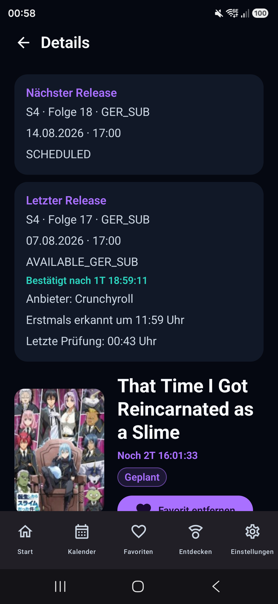
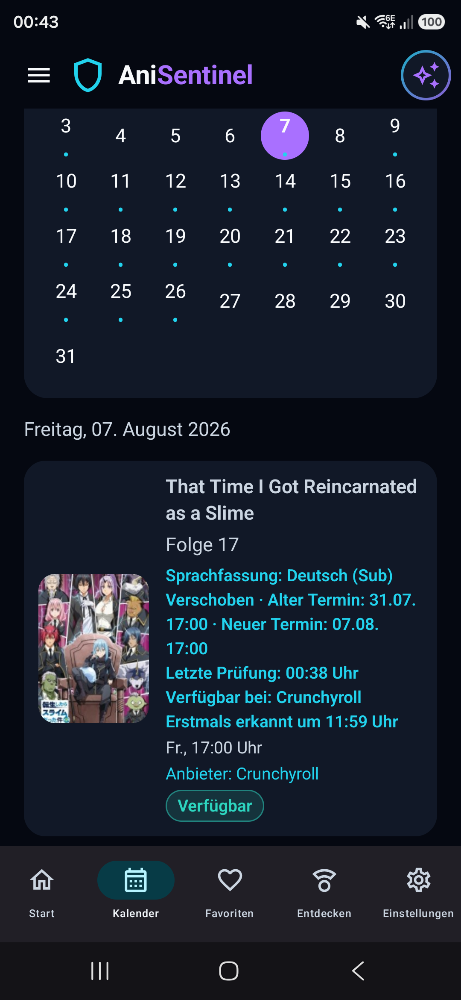
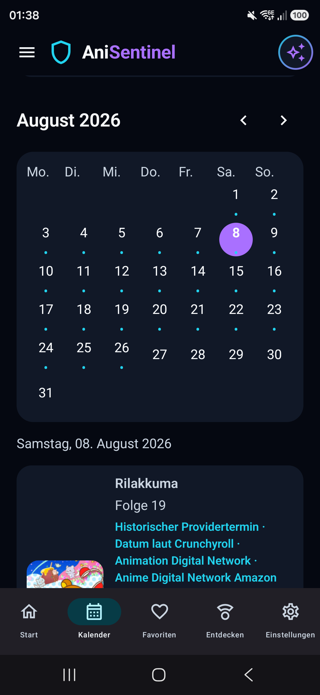
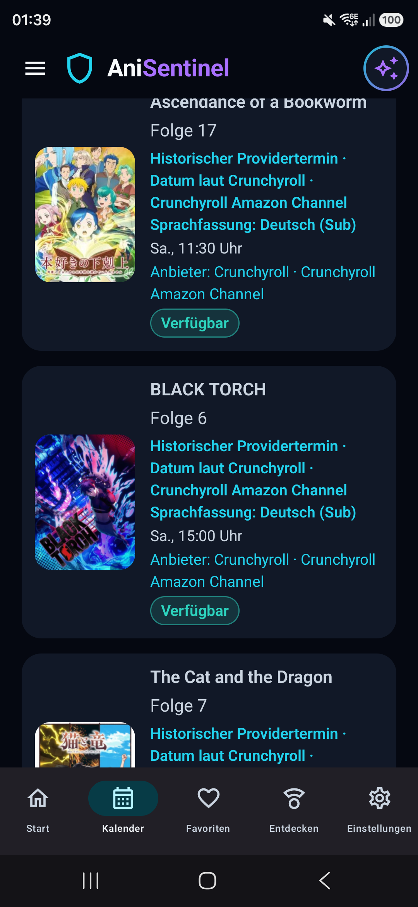

# AniSentinel

Aktueller Diagnose-/Teststand: **v0.25.6**. JustWatch Deutschland löst Titel und Anbieter auf; die konkrete Staffel, Episode und deutsche Sprachfassung werden anschließend direkt über öffentliche Metadaten des ausgewählten Providers geprüft. Provider können als animeweite Vorgabe und als gezielte Staffel-Ausnahme gewählt werden, jedoch nur nach bestätigtem deutschem Staffel-Mapping. Ungeprüfte alte Release-Zeilen erzeugen keine Phantomstaffeln. AniWorld bleibt der letzte technische Fallback. Kurzzeitige technische Providerfehler bleiben still und werden erst nach einem persistenten, providerweit deduplizierten Fehlerzustand benachrichtigt.

Der Bereich **Entdecken** zeigt aus dem deutschen JustWatch-Datenbestand nur sicher als Anime erkannte Serien und Filme sowie ausdrücklich belegte Live-Action-Adaptionen. Der allgemeine JustWatch-Film- und Serienkatalog wird dort nicht angeboten.

> ⚠️ **Entwicklungs- und Testversion:** AniSentinel befindet sich in aktiver Entwicklung. Externe Webseiten und inoffizielle Schnittstellen können sich ändern; Provideradapter und historische Importe werden weiterhin mit realen Releases validiert.

## Was ist AniSentinel?

AniSentinel ist eine native Android-App für deutsche Anime-Releasetermine. Sie bündelt aktuelle und historische Termine, Favoriten, Countdown-Anzeigen, Providerzuordnungen und Benachrichtigungen in einer responsiven Jetpack-Compose-Oberfläche.

## Hauptfunktionen

- deutscher Anime-Releasekalender mit getrennten `GER_SUB`- und `GER_DUB`-Einträgen
- Startseite, Kalender, Favoriten, Entdecken, Einstellungen und Detailansicht
- sekundengenaue Countdowns aus fester Zielzeit ohne Drift
- stille Release-Prüfstarts sowie deduplizierte Availability- und technische Fehlermeldungen
- provider-first Verfügbarkeitsprüfung über öffentliche Crunchyroll-, Netflix-, Disney+-, ADN- und ANIVERSE-Metadaten
- AniWorld als Quelle aktueller deutscher Termine und als letzter technischer Fallback
- historische Crunchyroll-Termine für gezielt synchronisierte Monate
- News- und Verschiebungssignale über Anime2You
- sichere HTTPS-Deep-Links zu real ermittelten Providerseiten
- Room als alleinige lokale UI-Datenbasis; DataStore für Einstellungen
- reale JustWatch-DE-Titelmetadaten für Handlung und Genres sowie Studioangaben, sofern die öffentliche Quelle sie eindeutig liefert
- Pull-to-Refresh in den datenabhängigen Hauptansichten; bestehende Room-Daten bleiben bei Netzwerkfehlern sichtbar
- kanonische Anime-Staffeln getrennt von providerabhängigen Staffelnummern
- persistente Providerwahl pro Staffel; Crunchyroll wird ohne manuelle Wahl nur bei bestätigter DACH-Staffel bevorzugt

### Release-Lifecycle und Providerwahl

Ein überfälliger Release bleibt nur während seines fachlich relevanten Beobachtungsfensters im engen AUTO-Watcher. Ein bekannter Episodennachfolger beendet den alten Watcher nach einer kurzen Karenz; spätestens nach 24 Stunden wird ein weiterhin unbestätigter Eintrag als `STALE_UNCONFIRMED` geführt. Dabei wird weder Verfügbarkeit erfunden noch eine technische Push-Meldung erzeugt. Historien- und Providerbackfills dürfen den Status später weiterhin korrigieren.

Technische Providerfehler werden pro Provider persistent gezählt. Eine sichtbare Systemmeldung ist frühestens nach drei aufeinanderfolgenden Fehlern über mindestens zehn Minuten möglich. Ein sechs Stunden langer providerweiter Cooldown verhindert, dass ein einzelner Crunchyroll-Ausfall für jeden Favoriten eine eigene Meldung erzeugt. `AVAILABLE` oder `NOT_AVAILABLE_YET` setzt den Fehlerzustand zurück.

Room trennt `AnimeSeason`, `ProviderSeasonMapping` und `ProviderPreference`. Eine manuelle Staffelwahl hat Vorrang, danach folgt eine Anime-Vorgabe, anschließend ein für die konkrete deutsche Staffel bestätigtes Crunchyroll-Angebot und erst danach ein anderer bestätigter DACH-Anbieter. Fehlt ein belegtes Angebot, zeigt die App dies ehrlich an.

### JustWatch-Metadaten

Bei einem eindeutig zugeordneten deutschen JustWatch-Katalogtitel speichert AniSentinel Handlung, Genres und vorhandene Produktionsangaben lokal in Room. Bereits gespeicherte stabile JustWatch-IDs werden bevorzugt; ohne ID gilt ein konservativer Abgleich aus Titel, Jahr und Inhaltstyp. Mehrdeutige Kandidaten bleiben leer, damit beispielsweise `One Piece` und `One Piece (2023)` nicht vermischt werden.

Dieser Metadatenweg ist strikt von der Episodenprüfung getrennt: JustWatch ordnet Titel und Streaminganbieter zu, bestätigt aber weder eine konkrete Episode noch deren deutsche Sprachfassung.

### Manuelles Aktualisieren

Pull-to-Refresh synchronisiert die für die sichtbare Ansicht relevanten Daten aus den aktivierten Quellen. Fällige, noch nicht bestätigte Favoriten können dabei direkt beim Anbieter geprüft werden. Bereits bestätigte Episoden werden nicht unnötig erneut geprüft; der manuelle Refresh startet keine historischen Watcher oder künstlichen Due-Ereignisse.

### Favoriten-Kategorien

Beim Hinzufügen oder Wiederherstellen eines Favoriten startet AniSentinel automatisch einen persistenten historischen Backfill. Der Zustand wird pro Favorit in Room gespeichert und nach App- oder Geräteneustarts fortgesetzt. Erst ein real importierter oder sicher angereicherter Crunchyroll-/ADN-Termin schließt den Backfill ab. Fehlende Providerzuordnungen und technische Fehler bleiben wiederholbar, sodass `Abgeschlossen` ohne alte Screenshots oder gespeicherte Kategoriezuordnungen aus echten Release-Daten neu entstehen kann.

- **Aktuell:** mindestens ein konkreter Release liegt heute
- **Demnächst:** kein heutiger, aber ein konkreter zukünftiger Release ist bekannt
- **Abgeschlossen:** mindestens ein vergangener Release ist bekannt und es gibt weder heute noch zukünftig einen konkreten Termin

Historische Crunchyroll-/ADN-Releases zählen für diese UI-Kategorisierung als reale Historie. Sie bleiben gleichzeitig strikt von Alarmen, Benachrichtigungen, AUTO-Watcher, WorkManager-Prüfungen und Fallbacks ausgeschlossen. Wird später ein neuer konkreter Termin importiert, wechselt der Titel automatisch von „Abgeschlossen“ zu „Demnächst“.

## Datenschutzfreundlich – kein Login erforderlich

AniSentinel benötigt keinen Crunchyroll-, ADN-, AniWorld-, Anime2You- oder JustWatch-Login. Die App speichert keine Streaming-Passwörter, Account-Cookies oder persönlichen Sitzungstokens. Sie ruft öffentlich beziehungsweise anonym erreichbare Metadaten ab und speichert Favoriten, Termine und Einstellungen lokal auf dem Gerät.

Das ist kein Versprechen, dass keinerlei Netzwerkdaten übertragen werden: Bei einer Synchronisation verbindet sich die App mit den unten dokumentierten Quellen. Es gibt keine Wiedergabe-, Download-, DRM- oder Streamingfunktion.

## Verschiebungen

Kurze Einzelverschiebungen gelten nur für die konkret betroffene Folge. Bei einer Pause von mindestens zwei Wochen oder unbekannter Wiederaufnahme wird der alte Wochenrhythmus nicht fortgeschrieben. Ein neuer Sendetag beziehungsweise eine neue Uhrzeit wird erst aus einem realen Quelltermin nach der Pause übernommen.

AniSentinel überwacht die veröffentlichte AniWorld-Seite [Animeverschiebungen](https://aniworld.to/support/frage/anime-verschiebungen). Aktuelle Meldungen erscheinen dauerhaft aus Room unter „Entdecken & Mehr → Verschiebungen“ mit interner Detailansicht und einem getrennten Link zur Originalmeldung.

Wenn Titel, Staffel, Episode und deutsche Sprachfassung eindeutig zu einem vorhandenen Release passen, erscheint der Zustand zusätzlich direkt im Kalender, bei Favoriten, auf der Startseite und in der Detailansicht. Der ursprüngliche Termin bleibt nachvollziehbar. Ein belastbarer Ersatztermin wird gespeichert und neu geplant; ohne Ersatztermin werden Due-Alarm, AUTO-Prüfung und Fallback gestoppt.

GER SUB und GER DUB werden getrennt behandelt. Gründe und Ersatztermine erscheinen nur, wenn AniWorld sie tatsächlich nennt. Eine unveränderte Meldung erzeugt weder einen zweiten Room-Eintrag noch eine weitere Benachrichtigung. Bereits direkt bestätigte Verfügbarkeit wird nicht überschrieben.

## Release- und Verfügbarkeitsüberwachung

JustWatch ordnet einen Titel dem deutschen Anbieterkatalog zu, bestätigt aber keine einzelne Episode. Danach prüft AniSentinel beim konkreten Anbieter Serie, Staffel, Episode und erwartete Sprache.

```text
JustWatch → Anbieterzuordnung
Crunchyroll/Netflix/Disney+/ADN/ANIVERSE → konkrete Episode und Sprache
technischer CHECK_FAILED oder UNSUPPORTED → kontrollierter AniWorld-Fallback
```

Ein direkt bestätigtes `AVAILABLE` wird sofort gespeichert und kann genau eine Benachrichtigung auslösen. Danach beendet AniSentinel AUTO-Überwachung, Provider-Retries und den Fallback. `NOT_AVAILABLE_YET` bedeutet eine erfolgreich ausgewertete Providerseite ohne Zielrelease und startet deshalb keinen technischen Fallback. Ein separater T+10-Alarm existiert nicht mehr. Bei einem Alarm-Rennen wird Room unmittelbar vor einem Fallback erneut geprüft.

### Watch-Profile

Manuell: 30 Sekunden, 1 Minute, 2 Minuten, 5 Minuten, 10 Minuten, 15 Minuten, 30 Minuten oder 1 Stunde.

Automatisch:

| Abstand zum Releasetermin | Prüfintervall |
|---|---:|
| 0–5 Minuten | 30 Sekunden |
| 5–10 Minuten | 1 Minute |
| 10–60 Minuten | 5 Minuten |
| 1–4 Stunden | 30 Minuten |
| danach | 1 Stunde |

## Kalender und historische Releases

- aktuell und zukünftig: reale deutsche AniWorld-Termine
- vergangene Crunchyroll-Inhalte: anonyme strukturierte Serien-, Staffel- und Episodenmetadaten
- vergangene ADN-Inhalte: nur eindeutig öffentlich belegte Metadaten
- historische Einträge bleiben in Room erhalten und lösen niemals Alarme, Watcher oder Benachrichtigungen aus
- `/de/videos/new` ist ausschließlich ein Releasesignal und niemals allein ein Verfügbarkeitsnachweis

Fehlende Termine oder Sprachfassungen werden nicht geraten. Ein japanischer Ausstrahlungstermin wird nicht als deutscher Providertermin ausgegeben.

## Datenquellen und technische Referenzen

| Quelle | Tatsächliche Rolle |
|---|---|
| [AniWorld](https://aniworld.to/animes) | aktuelle/kommende deutsche Termine, Verschiebungen, letzter technischer Fallback |
| [Crunchyroll Deutschland](https://www.crunchyroll.com/de/videos/new) | anonyme Katalog-, Serien-, Staffel- und Episodenmetadaten; direkte Prüfung und Historie |
| [Netflix Deutschland](https://www.netflix.com/de/) | öffentliche Titelseite nach JustWatch-Auflösung; konkrete Episode nur bei belastbarer Sprach-/Verfügbarkeitsevidenz |
| [Disney+ Deutschland](https://www.disneyplus.com/de-de) | öffentliche Entity-, Staffel- und Episodenmetadaten nach JustWatch-Auflösung |
| [ADN Deutschland](https://animationdigitalnetwork.com/de/) | anonyme DE-Katalog-/Episodenmetadaten einschließlich Platzhalterprüfung |
| [ANIVERSE bei Prime Video](https://www.primevideo.com/-/de_DE/channel/0bc7238a-ac57-4e04-a3f3-1be6f9aefa32) | öffentliche Prime-Titelseite; Bestätigung nur mit konkreter Episode und ANIVERSE-Channelnachweis |
| [Anime2You](https://www.anime2you.de/feed/) | öffentlicher RSS-Feed für News und Releasesignale |
| [JustWatch Deutschland](https://www.justwatch.com/de) | Katalog- und Providerzuordnung, nicht Episodenbestätigung |

[crunchy-labs/crunchyroll-rs](https://github.com/crunchy-labs/crunchyroll-rs) und [anidl/multi-downloader-nx](https://github.com/anidl/multi-downloader-nx) dienten ausschließlich als technische Recherchegrundlagen. AniSentinel ist weder Bestandteil noch offizieller Client dieser Projekte oder der genannten Anbieter. Wiedergabe-, Download-, Entschlüsselungs- und DRM-Logik wurde nicht übernommen.

Ältere AniList-, AnimeRadar- und AniSearch-Komponenten sind als gekapselte Entwicklungs- und Diagnosepfade im Quellcode vorhanden, aber nicht die aktive deutsche Release- oder Providerbestätigung.

## Screenshots

| Startseite | Detailansicht |
|---|---|
|  |  |

| Kalender August 2026 | Historischer Crunchyroll-Kalender |
|---|---|
|  |  |

## Installation und Build

Voraussetzungen:

- Android Studio mit JDK 17
- Android SDK 35
- Android-Gerät oder Emulator ab Android 8.0 (API 26)

Windows PowerShell:

```powershell
$env:JAVA_HOME = 'C:\Program Files\Android\Android Studio\jbr'
$env:ANDROID_HOME = "$env:LOCALAPPDATA\Android\Sdk"
.\gradlew.bat testDebugUnitTest assembleDebug
```

Die Debug-APK liegt anschließend unter `app/build/outputs/apk/debug/app-debug.apk`. Für ein verbundenes, autorisiertes Gerät:

```powershell
& "$env:ANDROID_HOME\platform-tools\adb.exe" install -r app\build\outputs\apk\debug\app-debug.apk
```

## Technischer Aufbau

- Kotlin und Jetpack Compose mit Material 3
- Room mit KSP und exportierten Schemata
- DataStore für lokale Einstellungen
- WorkManager und AlarmManager für begrenzte Releaseprüfungen
- Repository- und Adaptergrenzen zwischen UI, Domain, Datenbank und externen Quellen
- Fixture-, Parser-, Domain-, Room-, Golden-, Navigations- und reale Gerätediagnosetests

## Diagnose- und Teststatus

Version `0.24.8` trennt historische Favoritenklassifizierung und schedulbare Releases. Version `0.24.7` behob zuvor den vollständigen Provider-/Fallback-Lebenszyklus. Der generische Crunchyroll-Datenweg wurde auf einem realen Gerät zusätzlich mit einem zuvor nicht vorgegebenen Titel validiert. Die App bleibt ausdrücklich eine Diagnoseversion; eine dauerhafte öffentliche Verwendung inoffizieller Datenwege muss vor einer Produktveröffentlichung gesondert bewertet werden.

## Bekannte Einschränkungen

- externe Webseiten und inoffizielle Endpunkte können Markup, Schema oder Zugriff ändern
- ADN liefert anonym nicht für jede Episode einen exakten historischen Termin
- historische Monate werden gezielt synchronisiert, nicht massenhaft gecrawlt
- Provider- und Sprachverfügbarkeit wird nur bei belastbarer Evidenz bestätigt
- Debug-APK ist mit einem Entwicklungsschlüssel signiert und nicht für Stores vorgesehen

## Rechtliche Hinweise

AniSentinel ist ein unabhängiges Entwicklungsprojekt und kein offizieller Client von Crunchyroll, ADN, AniWorld, Anime2You oder JustWatch. Marken und Inhalte gehören ihren jeweiligen Rechteinhabern. Die Implementierung verwendet keine Login-Daten, keine Stream-URLs, keine Downloads und keine DRM-Umgehung. Abrufe sollen sparsam, zweckgebunden und mit lokaler Persistenz erfolgen.

## Weiterführende Dokumentation

- [Produktbeschreibung](docs/01_PRODUCT_SPEC.md)
- [Architektur](docs/04_ARCHITECTURE.md)
- [Provider-Checker](docs/06_PROVIDER_CHECKERS.md)
- [Release-Wächter](docs/05_RELEASE_WATCHER.md)
- [Validierung v0.24.7](docs/VALIDATION_V24_7_PROVIDER_FALLBACK.md)
